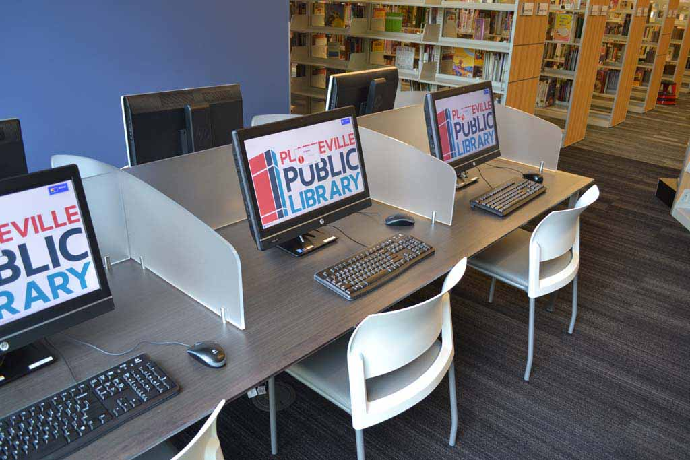

# digital-divide
<html>

<head>
    <title>デジタル・デバイドの解決策</title>
</head>

<body>
    <h1>デジタル・デバイドの解決策</h1>
    デジタル・デバイドの主な解決策として、以下のようなものが挙げられます。
    <ul>
        <strong>
            <li>スクール設立によるIT人材の増加</li>
        </strong>
        

        
地方部にITスキルを教えるパソコン学校やプログラミングスクールを設立し、その近隣に住む人々にスキルを教えるということができるはず。
            そこからIT業界へと進む人材を増やしていけるでしょう。また、IT技術が地方部でも普及することで、インフラの整備も進み、進出する企業が増え、地域の活性化にもつながる可能性もあります。 

        <!-- <strong>
            <li>多様化するスマート機器の普及</li>
        </strong>
        

        
スマートスピーカーやスマートウェアラブルデバイスなど、多様化するスマート機器の普及によりデジタルデバイドを解消できます。
            たとえば、双方向での音声認識技術が搭載されているスマートスピーカーを使えば、携帯電話を使えないお年寄りや小さな子供も簡単に扱うことができるでしょう。

        <strong>
            <li>インターネット上でのコミュニケーションの普及</li>
        </strong>
        

        
家族がスマートフォンやタブレットを使って親や祖父母と連絡を取ることで、高齢者世代にも自然とスマートフォンが普及していくことでしょう。
            会話をするだけならば、出歩く必要がない「Skype」などのアプリを使うことで、障害がある方でも家にいながらコミュニケーションが取れるでしょう。ITによって生活がとても楽になります。
 -->
        <strong>
            <li>無料で利用できる端末の設置</li>
        </strong>
        

        
お金の面で情報を得られない人たちのためにも、図書館や役所などの公共スペースに端末を設置するという解決策もあります。
            あるいは、廃棄処分される予定の端末をリユースして提供するという施策も打てるでしょう。

        <strong>
            <li>国際間におけるIT交流の活発化</li>
        </strong>
        

        
国際間デジタル・デバイドを解消するには、発展途上国と先進国の間でIT人材の交流を活発に行う必要があります。
            IT分野が未開の地でインフラ整備を先行投資すれば、現地でビジネスが拡大し、大きな見返りを受けられる可能性も秘めています。

    </ul>

</body>

</html>
